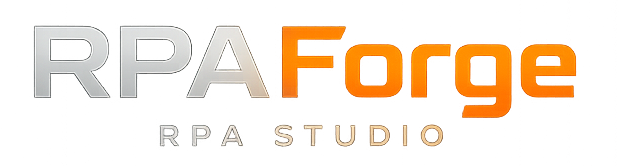

<div align="center">



**Robotic Process Automation Studio**

[](https://github.com/chelslava/rpaforge/actions/workflows/ci.yml)
[](https://pypi.org/project/rpaforge-core/)
[](https://pypi.org/project/rpaforge-core/)
[](LICENSE)
[](https://codecov.io/gh/chelslava/rpaforge)
[](CONTRIBUTING.md)

[Getting Started](#quick-start) · [Documentation](#documentation) · [Libraries](#rpa-libraries) · [Roadmap](#roadmap) · [Contributing](#contributing)

[🇷🇺 Русский](README.ru.md)

</div>

---

RPAForge is a modern, open-source **Robotic Process Automation** studio. Design automation workflows visually, debug them step by step, and execute them with a production-grade Python engine — no vendor lock-in, no license fees.

```python
from rpaforge import StudioEngine
from rpaforge_libraries.DesktopUI import DesktopUI

engine = StudioEngine()
engine.executor.register_library("DesktopUI", DesktopUI())

builder = engine.create_process("Notepad Automation")
builder.add_task("Open and Type", [
    ("DesktopUI.Open Application",  {"executable": "notepad.exe"}),
    ("DesktopUI.Wait For Window",   {"title": "Notepad", "timeout": "10s"}),
    ("DesktopUI.Input Text",        {"text": "Hello from RPAForge!"}),
    ("DesktopUI.Close Window",      {}),
])

result = engine.run(builder.build())
print(f"Status: {result.status}")
```

---

## Features

| | |
|---|---|
| **Visual Designer** | Drag-and-drop workflow builder powered by React Flow — nodes, edges, sub-diagrams, zoom/pan, and a mini-map |
| **Integrated Debugger** | Breakpoints, step over/into/out, variable inspection, call stacks, conditional stops |
| **14 RPA Libraries** | 80+ ready-made activities covering Desktop, Web, Excel, DataFrames, Database, OCR, HTTP, Credentials and more |
| **Python Bridge** | Asyncio JSON-RPC server — Electron talks to Python over IPC with full type safety |
| **Code Generation** | Diagram → Python, with topology validation before every run |
| **Security First** | SQL injection, path traversal, unsafe `getattr`, and IPC payload validation built-in (v0.3.1) |
| **Persistent Storage** | IndexedDB autosave for processes, variables, and execution history |
| **Cross-Platform** | Windows, macOS, Linux — one codebase |

---

## Architecture

```
┌──────────────────────────────────────────────────────────────────┐
│  RPAForge Studio  (Electron 42 + React 19 + TailwindCSS 4)      │
│                                                                  │
│   Designer │ Debugger │ Console │ Recorder                      │
│   React Flow · Monaco Editor · Zustand · Vite 6                 │
└────────────────────────────┬─────────────────────────────────────┘
                             │  JSON-RPC over IPC / Stdio
┌────────────────────────────┴─────────────────────────────────────┐
│  Python Bridge Server  (asyncio JSON-RPC)                        │
│                                                                  │
│   StudioEngine · ProcessRunner · Debugger · Recorder             │
│   CodeGenerator · Topology Validator                             │
└────────────────────────────┬─────────────────────────────────────┘
                             │
┌────────────────────────────┴─────────────────────────────────────┐
│  RPA Libraries  (14 modules · 55+ activities)                    │
│                                                                  │
│  DesktopUI  WebUI   Excel    Database  OCR   Credentials         │
│  File       HTTP    DateTime String    Flow  Variables  Spy …    │
└──────────────────────────────────────────────────────────────────┘
```

### Packages

```
rpaforge/
├── packages/
│   ├── core/           # Python engine — runner, debugger, bridge, codegen
│   ├── libraries/      # RPA library modules
│   ├── studio/         # Electron + React desktop application
│   └── orchestrator/   # Control Tower (planned)
├── docs/               # MKDocs documentation
├── .github/            # CI/CD workflows (ci, release, codeql, docs)
└── tools/              # Release scripts
```

---

## Quick Start

### Prerequisites

| Tool | Version |
|------|---------|
| Python | 3.10 – 3.13 |
| Node.js | 20+ |
| pnpm | 9+ (or npm 9+) |
| Git | any |
| VS Build Tools | Windows only, for native modules |

### Install & Run

```bash
# 1. Clone
git clone https://github.com/chelslava/rpaforge.git
cd rpaforge

# 2. Python packages (development mode)
pip install -r requirements-dev.txt
pre-commit install
pip install -e packages/core
pip install -e packages/libraries

# 3. Studio UI
cd packages/studio
pnpm install          # or: npm ci --include=optional

# 4. Verify
cd ../..
pytest packages/core/tests -v
cd packages/studio && pnpm test && cd ../..
```

### Start the Studio

```bash
cd packages/studio
pnpm dev              # Vite dev server + Electron hot-reload
```

### System Dependencies

<details>
<summary><b>Linux (Ubuntu/Debian)</b></summary>

```bash
sudo apt-get install -y libnss3 libnspr4 libatk-bridge2.0-0 libdrm2 libxkbcommon0 libgbm1
```
</details>

<details>
<summary><b>macOS</b></summary>

```bash
xcode-select --install
```
</details>

<details>
<summary><b>OCR support (all platforms)</b></summary>

```bash
pip install -e "packages/libraries[ocr]"

# Windows: https://github.com/UB-Mannheim/tesseract/wiki
# Linux:   sudo apt-get install tesseract-ocr
# macOS:   brew install tesseract
```
</details>

<details>
<summary><b>Web automation (Playwright)</b></summary>

```bash
pip install -e "packages/libraries[web]"
playwright install    # Downloads browser binaries
```
</details>

---

## RPA Libraries

| Library | Activities | Description | Extra deps |
|---------|-----------|-------------|------------|
| **DesktopUI** | 20+ | Windows UI automation — Win32, WPF, and Java | pywinauto, pillow |
| **WebUI** | 15+ | Browser automation (Chrome, Firefox, and Safari) | playwright |
| **Excel** | 8+ | Read/write XLSX spreadsheets | openpyxl |
| **DataFrames** | 28+ | Tabular data operations — filter, sort, join, aggregate | polars |
| **Database** | 6+ | SQL queries via SQLAlchemy ORM | sqlalchemy |
| **OCR** | 5+ | Text recognition — Tesseract + EasyOCR | pytesseract, easyocr |
| **Credentials** | 4+ | Encrypted OS credential store | cryptography, keyring |
| **File** | 8+ | File and folder operations | — |
| **HTTP** | 5+ | REST API requests | requests |
| **DateTime** | 6+ | Date/time utilities | — |
| **String** | 7+ | String manipulation | — |
| **Variables** | 4+ | Variable management and scoping | — |
| **Flow** | 4+ | Control flow — if, while, for | — |
| **Spy** | 3+ | Live UI element inspector overlay | uiautomation, pynput |

Install only what you need:

```bash
pip install -e "packages/libraries[desktop]"    # DesktopUI
pip install -e "packages/libraries[web]"         # WebUI
pip install -e "packages/libraries[dataframes]"  # DataFrames (polars)
pip install -e "packages/libraries[all]"         # Everything
```

---

## Development

### Common Commands

```bash
make test         # Run all Python tests
make lint         # ruff + mypy
make format       # ruff format
make docs         # Build MKDocs
make docs-serve   # Serve docs locally
make studio-dev   # Studio hot-reload

cd packages/studio
pnpm test         # Vitest
pnpm build        # Production build
```

### Tech Stack

**Backend (Python)**
- `asyncio` JSON-RPC bridge
- `Ruff` for linting and formatting
- `pytest` + `pytest-asyncio` for testing
- `mypy` for type checking

**Frontend (TypeScript)**
- React 19 + Vite 6
- React Flow 11 — visual diagram editor
- Zustand 5 — state management
- Monaco Editor — embedded code editor
- TailwindCSS 4 — utility styling
- Electron 42 — desktop packaging

---

## Project Status

| Package | Description | Version | Status |
|---------|-------------|---------|--------|
| `rpaforge-core` | Engine, debugger, JSON-RPC bridge | v0.3.3 | ✅ Stable |
| `rpaforge-libraries` | 14 RPA library modules | v0.3.3 | ✅ Stable |
| `rpaforge-studio` | Electron + React desktop UI | v0.3.3 | 🔄 Alpha |
| `rpaforge-orchestrator` | Control Tower | — | 🔜 Planned |

---

## Roadmap

### v0.3.1 — Security & Stability *(released)*
- ✅ SQL injection, path traversal, unsafe `getattr` mitigations
- ✅ IPC payload validation with strict schema enforcement
- ✅ IndexedDB infrastructure — autosave, variables, history
- ✅ Ruff-based inline Python validation with error highlighting
- ✅ Persistent logging with file rotation
- ✅ Freeze mode for Spy overlay

### v0.3.2 — Reliability *(released)*
- ✅ Serialized lifecycle lock for `_handle_run_diagram` — eliminates race conditions under concurrent execution
- ✅ Secure `ruff` executable resolution via `shutil.which()`
- ✅ Dependency security audit — resolved 14 Dependabot alerts via npm overrides

### v0.3.3 — DataFrames & Debug UX *(Current)*
- ✅ **DataFrames library** — 28 tabular data activities powered by Polars (load, filter, sort, join, aggregate, and more)
- ✅ **DataFrame variable type** — first-class `DataFrame` type in the visual designer
- ✅ **Visual table preview in debugger** — inspect DataFrame contents inline when stopped at a breakpoint
- ✅ i18n fixes — all UI strings translated to English and Russian

### v0.4.0 — Enhanced Workflow *(planned)*
- [ ] Smart activity recorder — capture and replay user actions
- [ ] Selector extraction and self-healing locators
- [ ] Variable Explorer panel improvements
- [ ] Execution history browser
- [ ] Sub-diagram parameter mapping UI

### v0.5.0 — Extensibility *(Q4 2026)*
- [ ] Plugin system and Library Development SDK
- [ ] Project templates marketplace
- [ ] Version control integration (Git-aware projects)

### v1.0.0 — Production Ready *(Q1 2027)*
- [ ] Orchestrator — Control Tower for multi-machine execution
- [ ] Scheduler and trigger engine
- [ ] Advanced monitoring and alerting
- [ ] Enterprise authentication (LDAP/SSO)

---

## Documentation

| Resource | Description |
|----------|-------------|
| [Getting Started](docs/getting-started/installation.md) | Installation and system setup |
| [Quick Start](docs/getting-started/quick-start.md) | Build your first automation |
| [Developer Guide](AGENTS.md) | Architecture, patterns, code conventions |
| [Contributing](CONTRIBUTING.md) | How to contribute code or docs |
| [Changelog](CHANGELOG.md) | Release notes |
| [Roadmap](ROADMAP.md) | Detailed feature roadmap |

---

## Contributing

Contributions are welcome — bug reports, feature requests, documentation, and code.

```bash
# Fork → clone → branch
git checkout -b feat/my-feature

# Make changes, then
make test && make lint

# Commit (Conventional Commits)
git commit -m "feat(libraries): add PDF extraction keyword"

# Open a PR against main
```

See [CONTRIBUTING.md](CONTRIBUTING.md) for the full workflow, coding standards, and PR checklist.

---

## Acknowledgements

- Visual designer powered by [React Flow](https://reactflow.dev/) and [Electron](https://www.electronjs.org/)
- Desktop automation via [pywinauto](https://pywinauto.readthedocs.io/)
- Web automation via [Playwright](https://playwright.dev/)
- Inspired by UiPath, Blue Prism, and Automation Anywhere

---

<div align="center">

**[GitHub Discussions](https://github.com/chelslava/rpaforge/discussions) · [Issue Tracker](https://github.com/chelslava/rpaforge/issues)**

Apache License 2.0 — Made with care by the RPAForge Community

</div>
